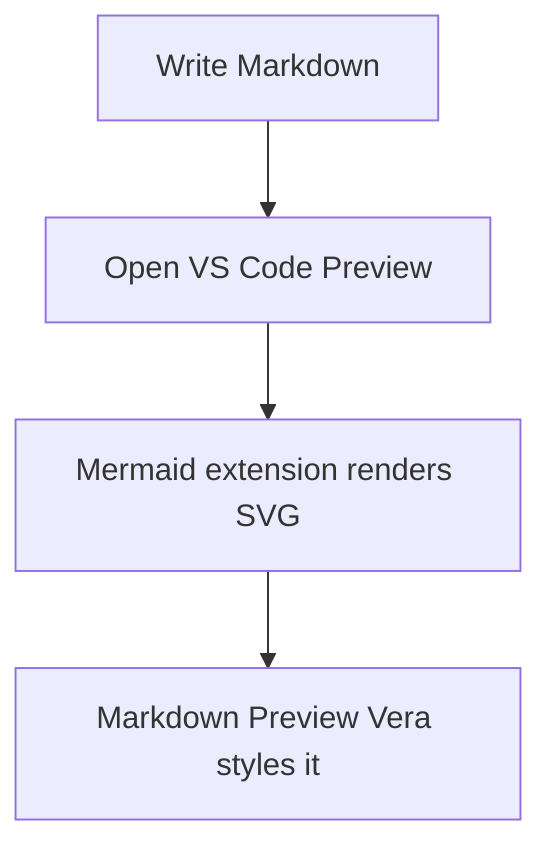

# Markdown Preview Vera

A polished dark theme for the built-in Markdown preview in VS Code and compatible VS Code forks.

The default preview is useful, but visually plain. This stylesheet turns Markdown documents into a cleaner reading surface with stronger typography, dark-mode contrast, styled tables, code blocks, blockquotes, task lists, images, details blocks, math, print styles, and Mermaid diagram styling.

## What It Changes

- Dark premium document surface for VS Code's built-in Markdown preview.
- Gradient headings, readable text colors, styled links, lists, tables, blockquotes, and horizontal rules.
- Terminal-style fenced code blocks with syntax-token color support where VS Code exposes tokens.
- Styled images, keyboard tags, footnotes, details/summary blocks, and KaTeX math containers.
- Mermaid diagram container and SVG styling when a Mermaid renderer extension is installed.
- Print mode that removes heavy shadows and keeps exported PDFs/paper output readable.
- Font-compatible base typography, so `markdown.preview.fontFamily`, `markdown.preview.fontSize`, and `markdown.preview.lineHeight` can still control the preview text.

## Quick Setup

Open your VS Code `settings.json` and add this:

```json
{
  "markdown.styles": [
    "https://cdn.jsdelivr.net/gh/Abdulrahman-Elsmmany/markdown-preview-settings@main/markdown-preview-vera.css"
  ]
}
```

Then open any Markdown file and run one of VS Code's built-in preview commands:

- `Markdown: Open Preview`
- `Markdown: Open Preview to the Side`
- `Markdown: Toggle Preview`

The same setting usually works in VS Code forks when they keep the built-in Markdown preview and support `markdown.styles`.

## Where To Put The Setting

Use global settings if you want every Markdown file on your machine to use the theme.

1. Open Command Palette.
2. Run `Preferences: Open User Settings (JSON)`.
3. Add the `markdown.styles` setting.

```json
{
  "markdown.styles": [
    "https://cdn.jsdelivr.net/gh/Abdulrahman-Elsmmany/markdown-preview-settings@main/markdown-preview-vera.css"
  ]
}
```

Use workspace settings if you want only one project to use the theme.

Create or edit `.vscode/settings.json` in your project:

```json
{
  "markdown.styles": [
    "https://cdn.jsdelivr.net/gh/Abdulrahman-Elsmmany/markdown-preview-settings@main/markdown-preview-vera.css"
  ]
}
```

## Why jsDelivr Instead Of GitHub Raw?

Use the jsDelivr URL:

```text
https://cdn.jsdelivr.net/gh/Abdulrahman-Elsmmany/markdown-preview-settings@main/markdown-preview-vera.css
```

Do not use the GitHub raw URL as the recommended setup:

```text
https://raw.githubusercontent.com/Abdulrahman-Elsmmany/markdown-preview-settings/main/markdown-preview-vera.css
```

VS Code loads Markdown preview CSS as a stylesheet. jsDelivr serves this file with the correct `text/css` content type. GitHub raw commonly serves raw files as `text/plain`, which can make webviews reject or ignore the stylesheet because of strict MIME checking.

## Which URL Should You Use?

For normal use, use the `@main` jsDelivr URL from the quick setup. This repo automatically purges the jsDelivr cache when `markdown-preview-vera.css` changes on `main`, so updates should reach users faster than waiting for the CDN cache to expire naturally.

For a fully stable setup, pin the URL to a commit SHA. This prevents surprise visual changes, but you must update the SHA manually when you want a newer version:

```text
https://cdn.jsdelivr.net/gh/Abdulrahman-Elsmmany/markdown-preview-settings@COMMIT_SHA/markdown-preview-vera.css
```

For active theme development, use a local file path. Local files avoid CDN caching completely, so every CSS edit is available as soon as you reload the Markdown preview.

## Local File Setup

If your editor blocks remote styles, your company network blocks CDNs, or you want a fully offline setup, use a local copy.

Clone this repo:

```powershell
git clone https://github.com/Abdulrahman-Elsmmany/markdown-preview-settings.git
```

Then point `markdown.styles` at the local CSS file.

Windows example:

```json
{
  "markdown.styles": [
    "D:/1Work/Github_Repos/personal/markdown-preview-settings/markdown-preview-vera.css"
  ]
}
```

macOS/Linux example:

```json
{
  "markdown.styles": [
    "/Users/you/Github/markdown-preview-settings/markdown-preview-vera.css"
  ]
}
```

Workspace-relative example:

```json
{
  "markdown.styles": [
    "./markdown-preview-vera.css"
  ]
}
```

## Recommended Preview Settings

This theme does not set the base Markdown preview font family, font size, or line height. VS Code's built-in preview CSS owns those values, so the main preview text follows these settings:

```json
{
  "markdown.preview.fontFamily": "Inter, Segoe UI, system-ui, sans-serif",
  "markdown.preview.fontSize": 18,
  "markdown.preview.lineHeight": 1.6,
  "markdown.preview.scrollPreviewWithEditor": true,
  "markdown.preview.scrollEditorWithPreview": true
}
```

Code blocks still use a monospace stack from the CSS so source snippets stay readable:

```css
--mono: "JetBrains Mono", "Cascadia Code", "Fira Code", Consolas, monospace;
```

## Mermaid Diagrams

CSS can style Mermaid output, but CSS cannot render Mermaid syntax by itself. Install a renderer extension first:

```powershell
code --install-extension bierner.markdown-mermaid
```

Recommended Mermaid settings:

```json
{
  "markdown-mermaid.darkModeTheme": "dark",
  "markdown-mermaid.controls.show": "onHoverOrFocus",
  "markdown-mermaid.mouseNavigation.enabled": "alt",
  "markdown-mermaid.maxHeight": "80vh"
}
```

Then use normal Mermaid fenced code blocks:

````markdown

````

The extension renders the diagram into SVG/HTML. This stylesheet then styles the diagram container, nodes, edges, labels, clusters, sequence diagrams, class diagrams, state diagrams, pie charts, and Gantt elements.

## Using It In VS Code Forks

This theme should work in VS Code-compatible editors when all of these are true:

- The editor includes VS Code's built-in Markdown preview.
- The editor supports the `markdown.styles` setting.
- The editor allows the preview webview to load local or remote CSS.

Some forks change the preview implementation or block custom styles for security. If the same `settings.json` works in official VS Code but not in a fork, the fork is probably ignoring, replacing, or sandboxing `markdown.styles`.

## Troubleshooting

### The CSS Does Not Apply

- Reload the editor window with `Developer: Reload Window`.
- Reopen the Markdown preview after changing `settings.json`.
- Confirm the setting name is exactly `markdown.styles`.
- Confirm the value is an array of strings, not one string.
- Use the jsDelivr URL or a local file path.
- Check whether your workspace is trusted if your VS Code fork restricts webview resources.

### The Raw GitHub URL Does Not Work

Use jsDelivr instead. The recommended URL is:

```text
https://cdn.jsdelivr.net/gh/Abdulrahman-Elsmmany/markdown-preview-settings@main/markdown-preview-vera.css
```

GitHub raw is great for viewing a file, but it is not the best stylesheet delivery URL for VS Code Markdown preview.

### CDN Updates Look Delayed

jsDelivr caches branch URLs. This repo has an automatic GitHub Actions purge for changes to `markdown-preview-vera.css`, but edge caches can still take a short time to refresh. If you changed the CSS and the preview still shows the old version, try one of these:

- Reload the VS Code window.
- Close and reopen the Markdown preview.
- Wait briefly for CDN edges to refresh after the purge.
- Use a commit-pinned URL for a specific version.
- Use a local file while actively editing the CSS.

Commit-pinned URL format:

```text
https://cdn.jsdelivr.net/gh/Abdulrahman-Elsmmany/markdown-preview-settings@COMMIT_SHA/markdown-preview-vera.css
```

### Mermaid Does Not Render

Install a Mermaid Markdown preview extension, such as `bierner.markdown-mermaid`. Without a renderer extension, VS Code will show the fenced code block as code, and this CSS will only style it as a normal code block.

### Markdown Preview Font Does Not Change

Older versions of this theme set fixed page typography in CSS, which overrode `markdown.preview.fontFamily` and `markdown.preview.fontSize`. The current theme leaves the base document font family, size, and line height to VS Code's built-in Markdown preview CSS, so these settings can work:

```json
{
  "markdown.preview.fontFamily": "Inter, Segoe UI, system-ui, sans-serif",
  "markdown.preview.fontSize": 18,
  "markdown.preview.lineHeight": 1.6
}
```

If the font still does not change:

- Make sure the installed font name is spelled correctly.
- Put font names with spaces in quotes inside the setting value.
- Reload the VS Code window.
- Test in official VS Code to check whether your fork ignores preview typography settings.
- Check whether another stylesheet in `markdown.styles` appears after this theme and overrides typography.

## References

- [VS Code Markdown documentation](https://code.visualstudio.com/docs/languages/markdown)
- [VS Code Markdown preview CSS extension docs](https://code.visualstudio.com/api/extension-guides/markdown-extension)

## License

MIT. See [LICENSE](LICENSE).
