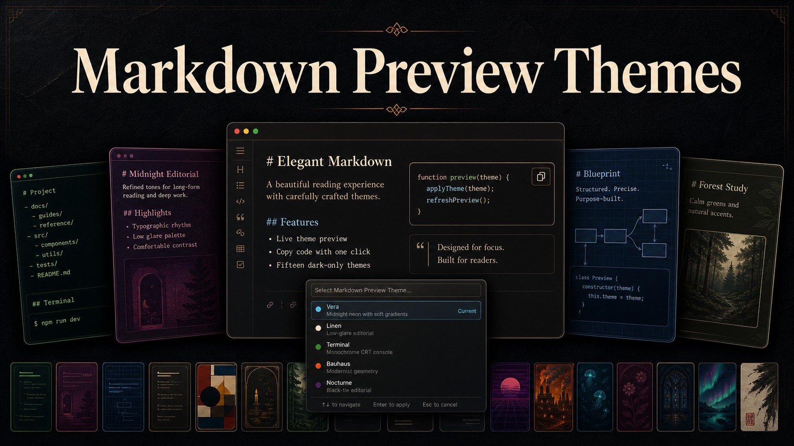
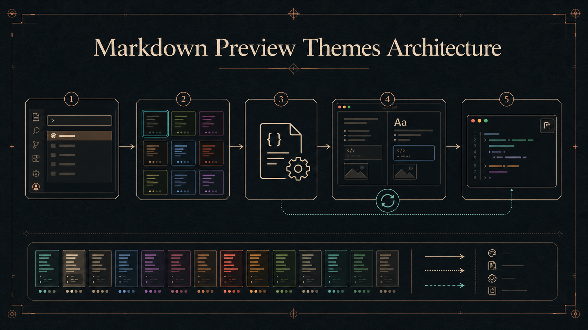
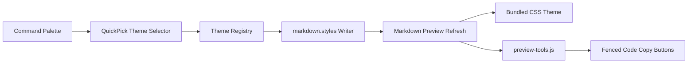

# Markdown Preview Themes

> A VS Code extension that switches the built-in Markdown preview between fifteen dark reading themes, with live theme preview and one-click fenced-code copy.

<p align="center">
  <samp>
    <a href="#demo">demo</a> |
    <a href="#quickstart">quickstart</a> |
    <a href="#themes">themes</a> |
    <a href="#architecture">architecture</a>
  </samp>
</p>

[](https://code.visualstudio.com/)
[](#themes)
[](LICENSE)

The extension keeps VS Code's native Markdown renderer, scroll synchronization, extensions, and Mermaid support. It adds local CSS themes, a live picker, and copy buttons for fenced code blocks without CDN requests, API keys, or manual `markdown.styles` edits.

---

## Demo

The main workflow is deliberately small: open any Markdown preview, run the theme selector, move through the list, and watch the active preview update before you commit the choice.

```text
Markdown file -> Open Preview -> Select Theme -> live preview -> Enter to save
```

The static comparison fixture is available in [showcase.html](https://github.com/Abdulrahman-Elsmmany/markdown-preview-settings/blob/main/showcase.html) for CSS review while developing themes.

## Quickstart

Install from a local VSIX:

```powershell
npm install
npm run package
code --install-extension .\dist\markdown-preview-themes-0.3.0.vsix
```

Reload VS Code, open a Markdown file, then run:

```text
Markdown Preview Themes: Select Theme
```

Move through themes with the keyboard or pointer to preview them live. Press `Enter` to keep a theme, or `Escape` to restore the theme that was active before opening the picker.

Run `Markdown Preview Themes: Reset To Vera` before uninstalling if you want the extension to remove its managed stylesheet from VS Code settings.

## Themes

| Theme | Direction | Best for |
| --- | --- | --- |
| `Vera` | Midnight neon with soft gradients and terminal-style code blocks | General technical notes |
| `Linen` | Low-glare midnight editorial | Long-form writing |
| `Terminal` | Monochrome CRT console with amber system accents | CLI-focused references |
| `Blueprint` | Technical drawing board with precise drafting lines | Architecture documents |
| `Bauhaus` | Dark modernist poster with primary-color geometry | Project briefs |
| `Nocturne` | Black-tie editorial with brass, oxblood, and velvet depth | Refined notes and essays |
| `Forest` | Rain-soaked evergreen study with moss and firefly accents | Calm daily reading |
| `Graphite` | Restrained monochrome focus mode | Low-distraction review |
| `Synthwave` | Neon horizon, arcade glow, and retro-future grid energy | High-energy documentation |
| `Ember` | Industrial charcoal workshop with copper and heat accents | Engineering runbooks |
| `Abyss` | Deep-ocean calm with bioluminescent cyan and cobalt depth | Calm technical reading |
| `Rosewood` | Plum library, rose ink, and warm mahogany | Editorial writing |
| `Cathedral` | Midnight stone, stained glass, and jewel-toned geometry | Structured documentation |
| `Aurora` | Polar night with northern-light ribbons and ice accents | Soft luminous reading |
| `Inkstone` | Sumi-black study with vermilion seals and quiet paper grain | Focused review |

## Architecture



The generated artwork gives the overview; the flow below is the precise implementation path.



Key implementation points:

- `extension.js` owns the VS Code commands, live preview picker, settings writes, and preview refresh.
- `lib/theme-config.js` owns the theme registry and managed-stylesheet replacement logic.
- `markdown-preview-vera.css` is the default stylesheet contributed directly by the extension.
- `themes/*.css` are alternate dark-only stylesheets added to `markdown.styles` when selected.
- `preview-tools.js` injects copy buttons into fenced code blocks and copies only the original code text.

## Development

Install dependencies:

```powershell
npm install
```

Run focused tests:

```powershell
npm test
```

Check packaged files:

```powershell
npm run check-package
```

Package a VSIX:

```powershell
npm run package
```

Press `F5` in VS Code to start an Extension Development Host, then run `Markdown Preview Themes: Select Theme`.

## Project Layout

```text
.
+-- extension.js
+-- lib/theme-config.js
+-- markdown-preview-vera.css
+-- preview-tools.css
+-- preview-tools.js
+-- themes/
+-- test/
+-- images/icon.png
+-- assets/
|   +-- thumbnail-dark.png
|   +-- architecture-art-dark.png
+-- showcase.html
```

## Mermaid Diagrams

CSS can style Markdown output, but CSS cannot render Mermaid syntax by itself. Install a renderer extension first:

```powershell
code --install-extension bierner.markdown-mermaid
```

The theme pack intentionally leaves Mermaid nodes, labels, edges, sizing, and contrast under the renderer extension's defaults.

## Limitations

- The extension changes the built-in Markdown preview, not the VS Code editor theme.
- Theme switching writes to the active `markdown.styles` settings scope, preserving unrelated user styles where possible.
- Mermaid rendering still depends on a Markdown Mermaid renderer extension.

## Status

Local VSIX build is working at version `0.3.0` for personal installation.

## Contact

[Abdulrahman Elsmmany](https://github.com/Abdulrahman-Elsmmany) - open an issue in this repository for bugs or theme requests.

## License

[MIT License](LICENSE).
