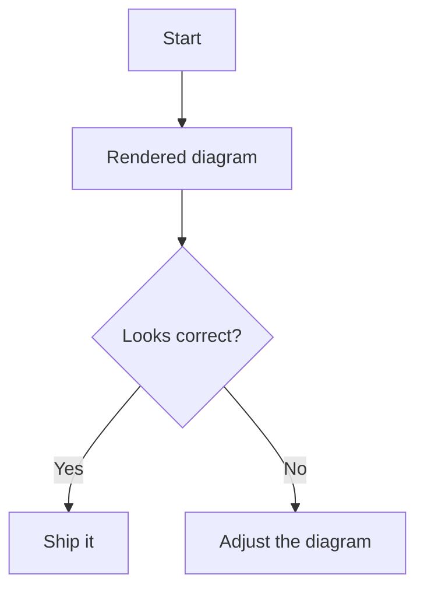

# Markdown Preview Vera

Premium dark CSS for VS Code's built-in Markdown preview.

## Setup

Add the stylesheet to your VS Code `settings.json`:

```json
{
  "markdown.styles": [
    "https://cdn.jsdelivr.net/gh/Abdulrahman-Elsmmany/markdown-preview-settings@main/markdown-preview-vera.css"
  ]
}
```

## Mermaid Diagrams

This stylesheet makes rendered Mermaid diagrams match the theme, but CSS cannot render a fenced Mermaid code block by itself. Install the VS Code renderer extension:

```powershell
code --install-extension bierner.markdown-mermaid
```

Recommended settings:

```json
{
  "markdown-mermaid.darkModeTheme": "dark",
  "markdown-mermaid.controls.show": "onHoverOrFocus",
  "markdown-mermaid.mouseNavigation.enabled": "alt",
  "markdown-mermaid.maxHeight": "80vh"
}
```

Use standard Mermaid fenced code blocks:

````markdown

````

The renderer extension converts the block into SVG/HTML. This CSS then styles the diagram container, nodes, edges, labels, clusters, sequence diagrams, class diagrams, state diagrams, pie charts, and Gantt elements.

## Notes

- Normal fenced code blocks keep the existing terminal-style design.
- Large diagrams are contained in a scrollable polished surface.
- Print mode removes heavy effects so diagrams remain legible on paper or PDF.
